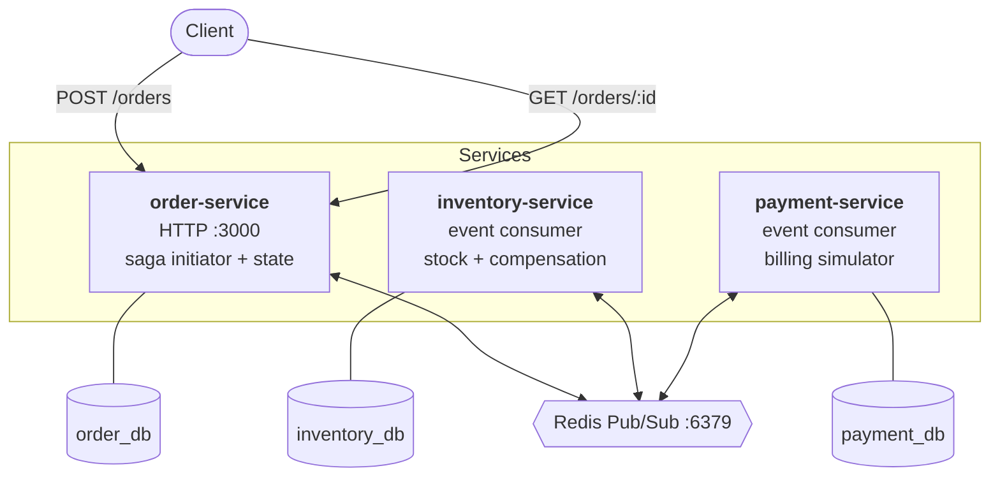
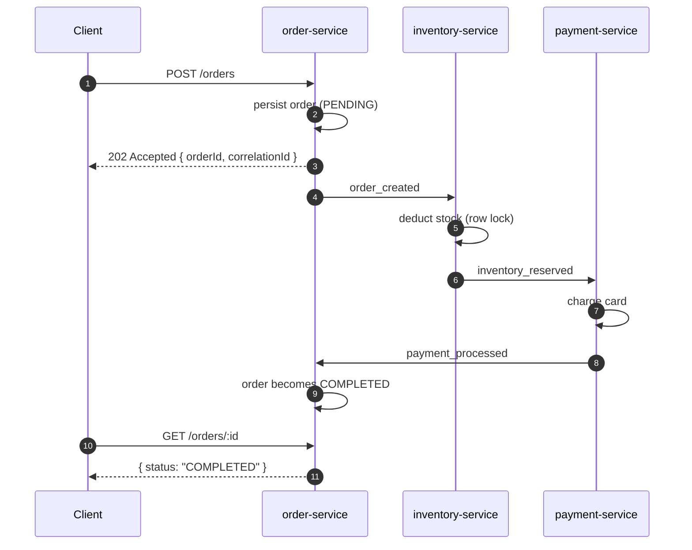
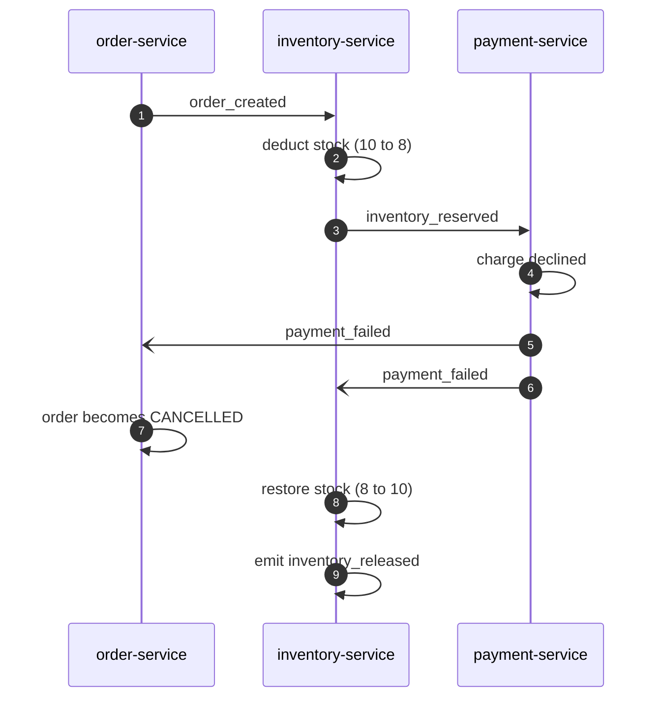

# Distributed Saga Engine

An event-driven microservices system for managing distributed transactions and
compensating failure workflows across independent service databases — using the
Choreographed Saga pattern.

---

## Table of contents

- [The problem](#the-problem)
- [Architecture](#architecture)
- [Event catalogue](#event-catalogue)
- [Saga flows](#saga-flows)
- [Tech stack](#tech-stack)
- [Getting started](#getting-started)
- [Configuration](#configuration)
- [API reference](#api-reference)
- [Verification](#verification)
- [Implementation notes](#implementation-notes)
- [Project structure](#project-structure)
- [Known limitations](#known-limitations)
- [License](#license)

---

## The problem

A checkout spans three services, each owning its own database:

1. Create the order
2. Reserve the stock
3. Charge the card

A single ACID transaction cannot span all three. Two-phase commit could, but it holds
locks across service boundaries for the duration of the transaction, couples every
participant to a coordinator, and blocks everything if that coordinator dies.

The **Saga pattern** replaces one distributed transaction with a sequence of local ones.
Each service commits its own work and announces what it did. If a later step fails,
earlier steps are undone by **compensating transactions** — new, forward-moving
transactions that semantically reverse what was already committed.

This implementation is **choreographed**: there is no orchestrator. Each service simply
reacts to events. `payment_failed`, for example, is consumed independently by two
services — one cancels the order, the other restores stock — and neither knows the other
is listening.

---

## Architecture



Every service owns exactly one logical database and holds no credentials for any other.
Cross-service reads are impossible by construction — state travels only as event
payloads.

---

## Event catalogue

| Event | Published by | Consumed by | Meaning |
|---|---|---|---|
| `order_created` | order-service | inventory-service | Order persisted as `PENDING`; saga begins |
| `inventory_reserved` | inventory-service | payment-service | Stock deducted successfully |
| `inventory_failed` | inventory-service | order-service | Insufficient stock; saga ends |
| `payment_processed` | payment-service | order-service | Charge succeeded; saga completes |
| `payment_failed` | payment-service | order-service, inventory-service | Charge declined; compensation begins |
| `inventory_released` | inventory-service | — | Stock restored by compensation |

Every payload carries a common envelope:

```ts
interface SagaEventEnvelope {
  eventId: string;        // unique per emission — the idempotency key
  correlationId: string;  // constant for the whole saga — the trace key
  occurredAt: string;     // ISO 8601
}
```

---

## Saga flows

### Happy path



### Compensating path — payment declined



One event, two independent consumers. That fan-out is the pattern's defining
characteristic — the failure notification is broadcast, not routed.

### Short-circuit path — insufficient stock

Nothing was reserved and no payment was attempted, so there is nothing to compensate.
`inventory_failed` cancels the order and the saga ends there.

---

## Tech stack

| Layer | Choice | Notes |
|---|---|---|
| Framework | NestJS 11 (CommonJS) | Nest 12 is ESM-only; 11 keeps the TypeORM ecosystem straightforward |
| Language | TypeScript 5.9 | `strict` enabled |
| Transport | Redis Pub/Sub | via `@nestjs/microservices` `Transport.REDIS` and `ioredis` |
| Persistence | PostgreSQL 16 + TypeORM | one logical database per service |
| Structure | Nest monorepo | three apps plus a shared library (`@app/common`) |
| Infrastructure | Docker Compose | PostgreSQL and Redis |

---

## Getting started

### Prerequisites

- Node.js 20+
- Docker Desktop

### 1. Start the infrastructure

```bash
docker compose up -d
```

PostgreSQL is published on host port **5433** (5432 is commonly already in use) and Redis
on **6379**. The Postgres entrypoint creates `order_db`, `inventory_db` and `payment_db`
on first initialisation.

Verify:

```bash
docker compose ps
```

```bash
docker exec saga_redis redis-cli ping
```

### 2. Install dependencies

```bash
npm install
```

### 3. Create the environment file

`.env` is gitignored and must be created at the repository root — see
[Configuration](#configuration) for the full key list.

### 4. Run the services

In three terminals:

```bash
npm run start:order
```

```bash
npm run start:inventory
```

```bash
npm run start:payment
```

Tables are created automatically (`TYPEORM_SYNCHRONIZE=true`), and inventory seeds itself
on first boot:

| SKU | Quantity |
|---|---|
| `SKU-LAPTOP` | 10 |
| `SKU-MOUSE` | 100 |
| `SKU-KEYBOARD` | 50 |
| `SKU-DESK` | 5 |
| `SKU-CHAIR` | 3 |

---

## Configuration

A single `.env` at the repository root is read by Docker Compose **and** all three
services.

```ini
NODE_ENV=development
LOG_LEVEL=debug

# PostgreSQL — one instance, three isolated logical databases
POSTGRES_HOST=localhost
POSTGRES_PORT=5433
POSTGRES_USER=saga
POSTGRES_PASSWORD=saga_password

ORDER_DB_NAME=order_db
INVENTORY_DB_NAME=inventory_db
PAYMENT_DB_NAME=payment_db

TYPEORM_SYNCHRONIZE=true
TYPEORM_LOGGING=false

# Redis — message broker and idempotency store
REDIS_HOST=localhost
REDIS_PORT=6379

# Saga behaviour
IDEMPOTENCY_TTL_SECONDS=86400
PAYMENT_SIMULATE_FAILURE=false

# Only order-service exposes HTTP
ORDER_SERVICE_HTTP_PORT=3000
```

| Key | Purpose |
|---|---|
| `PAYMENT_SIMULATE_FAILURE` | `true` forces every charge to decline, exercising the compensating path |
| `IDEMPOTENCY_TTL_SECONDS` | How long a consumed `eventId` is remembered |
| `TYPEORM_SYNCHRONIZE` | Auto-creates schema. Convenient here; use migrations in production |

Compose declares no fallback defaults, so a missing key fails loudly rather than quietly
starting against the wrong database.

---

## API reference

Only `order-service` exposes HTTP. The other two are pure event consumers.

### `POST /orders`

Starts a saga.

```json
{
  "customerId": "cust-001",
  "items": [
    { "productId": "SKU-LAPTOP", "quantity": 2, "unitPrice": 899.50 }
  ]
}
```

Responds `202 Accepted`:

```json
{
  "orderId": "2d2618c6-...",
  "correlationId": "700da01e-...",
  "status": "PENDING",
  "statusUrl": "/orders/2d2618c6-...",
  "message": "Saga started. Poll statusUrl for the final outcome."
}
```

`202`, not `201`, and deliberately so: the saga is asynchronous, so at the moment this
responds no stock has been checked and no card has been charged. Holding the request open
until the saga finished would rebuild exactly the synchronous coupling the pattern exists
to remove.

`totalAmount` is computed server-side from the line items; the client cannot supply it.
Payloads are validated with `class-validator`, and unknown properties are rejected.

### `GET /orders/:id`

Poll target for the outcome.

```json
{
  "id": "2d2618c6-...",
  "customerId": "cust-001",
  "items": [],
  "totalAmount": 1799,
  "status": "COMPLETED",
  "correlationId": "700da01e-...",
  "failureReason": null,
  "createdAt": "2026-09-07T21:53:48.981Z",
  "updatedAt": "2026-09-07T21:53:49.231Z"
}
```

`status` is one of `PENDING`, `COMPLETED` or `CANCELLED`.

---

## Verification

Sample output below is taken from real runs; UUIDs are shortened.

### Happy path

Requires `PAYMENT_SIMULATE_FAILURE=false`.

```bash
curl -X POST http://localhost:3000/orders -H "Content-Type: application/json" -d '{"customerId":"cust-001","items":[{"productId":"SKU-LAPTOP","quantity":2,"unitPrice":899.50}]}'
```

```
[order-service]     STATE     Order(2d2618c6) NEW -> PENDING
[order-service]     PUBLISH   order_created        totalAmount=1799
[inventory-service] RECEIVE   order_created
[inventory-service] PUBLISH   inventory_reserved
[payment-service]   RECEIVE   inventory_reserved   amount=1799
[payment-service]   PUBLISH   payment_processed    paymentId=5208e617
[order-service]     RECEIVE   payment_processed
[order-service]     STATE     Order(2d2618c6) PENDING -> COMPLETED
```

**Result** — order `COMPLETED`, `SKU-LAPTOP` 10 to 8, payment row `SUCCEEDED`.

### Compensating path

Set `PAYMENT_SIMULATE_FAILURE=true` and restart `payment-service`. It announces its mode
on boot:

```
[Bootstrap] payment-service subscribed to Redis Pub/Sub (simulate failure: true)
```

```
[order-service]     STATE      Order(55638586) NEW -> PENDING
[order-service]     PUBLISH    order_created        totalAmount=1799
[inventory-service] RECEIVE    order_created
[inventory-service] PUBLISH    inventory_reserved                    stock 8 -> 6
[payment-service]   RECEIVE    inventory_reserved   amount=1799
[payment-service]   REJECT     card declined by issuer (simulated)
[payment-service]   PUBLISH    payment_failed
[order-service]     RECEIVE    payment_failed
[order-service]     STATE      Order(55638586) PENDING -> CANCELLED
[inventory-service] COMPENSATE payment_failed
[inventory-service] PUBLISH    inventory_released                    stock 6 -> 8
```

**Result** — order `CANCELLED` with reason `Payment failed: card declined by issuer
(simulated)`, stock restored to its original level, payment row `DECLINED`.

### Short-circuit path

`SKU-CHAIR` holds 3 units:

```bash
curl -X POST http://localhost:3000/orders -H "Content-Type: application/json" -d '{"customerId":"cust-003","items":[{"productId":"SKU-CHAIR","quantity":5,"unitPrice":80.00}]}'
```

```
[inventory-service] REJECT    insufficient stock for SKU-CHAIR: have 3, need 5
[inventory-service] PUBLISH   inventory_failed
[order-service]     RECEIVE   inventory_failed
[order-service]     STATE     Order(139c0974) PENDING -> CANCELLED
```

**Result** — order `CANCELLED`, stock untouched, **zero** payment rows created.

### Idempotency

Replay a consumed event using the same `eventId`:

```bash
docker exec saga_redis redis-cli publish payment_processed '{"pattern":"payment_processed","data":{"eventId":"evt-001","correlationId":"CORR","occurredAt":"2026-01-01T00:00:00.000Z","orderId":"ORDER","paymentId":"p1","amount":1799}}'
```

```
[order-service] RECEIVE   payment_processed
[order-service] DUPLICATE payment_processed  action=skipped, state unchanged
```

Keys are scoped per consumer, so one replayed event yields one key per service:

```bash
docker exec saga_redis redis-cli keys "saga:idempotency:*"
```

```
saga:idempotency:order-service:evt-001
saga:idempotency:inventory-service:evt-001
```

### Inspecting state

```bash
docker exec saga_postgres psql -U saga -d inventory_db -c 'SELECT * FROM stock_items ORDER BY 1'
```

Database isolation holds — each table exists in exactly one database. The following
returns `0`, because `order_db` is the only database containing `orders`:

```bash
docker exec saga_postgres psql -U saga -d inventory_db -tAc "SELECT count(*) FROM information_schema.tables WHERE table_name='orders'"
```

---

## Implementation notes

### Correlation IDs

A `correlationId` is minted once, when the order is placed, and copied unchanged onto
every downstream event. One saga is therefore traceable across three separate service
consoles by grepping a single value — the only practical way to debug a failure spanning
services that share no database.

### Idempotency

Every consumed event is claimed in Redis with a single atomic `SET NX EX` before its
handler runs, so two concurrent deliveries cannot both win.

Keys are scoped **per consumer**:

```
saga:idempotency:{service}:{eventId}
```

This matters. `payment_failed` is legitimately handled by two different services; a key
of only `eventId` would let whichever service handled it first lock the other out —
silently skipping the compensating transaction, with no error raised anywhere.

If a handler throws, the claim is released before rethrowing, so a transient database
error does not permanently swallow the event.

### Semantic lock

Sagas trade away the isolation of an ACID transaction. `OrderStatus.PENDING` is the
countermeasure: the row is committed and visible, but explicitly marked in-flight so no
reader mistakes an unsettled order for a final one.

### Deadlock-free stock deduction

Reservation runs inside a transaction taking `pessimistic_write` row locks, with line
items **sorted by `productId` before locking**. Two concurrent sagas touching the same
SKUs in different order would otherwise deadlock.

Compensation uses an atomic `increment` rather than read-modify-write, so restoring stock
needs no lock at all.

### Terminal-state guard

Beyond idempotency, transitions are applied only from `PENDING`. Idempotency stops the
*same* event being processed twice; this guard stops two *different* terminal events
racing — a late `inventory_failed` cannot overwrite an order that payment already
completed.

### Database-per-service

The TypeORM factory takes the database name as a required argument rather than reading a
shared variable, and entities are passed explicitly rather than discovered by glob. A
service has no way to name — or accidentally load — another service's schema.

---

## Project structure

```
apps/
├── order-service/           HTTP gateway + saga state machine  -> order_db
│   └── src/order/           entity, DTO, controllers, service
├── inventory-service/       stock manager + compensation       -> inventory_db
│   └── src/inventory/       entity, events controller, service
└── payment-service/         billing simulator                  -> payment_db
    └── src/payment/         entity, events controller, service

libs/common/src/             shared library, imported as @app/common
├── events/                  event patterns, envelope, six payload classes
├── idempotency/             Redis client + deduplication guard
├── logging/                 structured saga logger
└── config/                  Redis transport + TypeORM factories

docker/postgres/init-db.sql  creates the three logical databases
docker-compose.yml           PostgreSQL 16 + Redis 7
```

### Scripts

| Command | Description |
|---|---|
| `npm run start:order` | Run order-service in watch mode |
| `npm run start:inventory` | Run inventory-service in watch mode |
| `npm run start:payment` | Run payment-service in watch mode |
| `npm run build:all` | Build the shared library and all three services |
| `npm run lint` | Lint with oxlint |
| `npm run format` | Format with Prettier |

---

## Known limitations

These are deliberate, and documented rather than hidden.

**Dual write.** Each service commits its state change and publishes its event as two
separate operations with no shared transaction. A crash between them strands the saga.
The fix is the **Transactional Outbox** pattern: write the event to an outbox table inside
the same transaction, then let a relay publish it. The relay may publish twice, which the
existing idempotency guard already absorbs. Marked `KNOWN GAP` in `order.service.ts`.

**No automated tests.** Verification is currently manual. An integration test driving the
happy and compensating paths is the most valuable next addition.

**Redis Pub/Sub is fire-and-forget.** A service that is down when an event is published
never receives it, and there is no replay. Acceptable for demonstrating choreography;
production would want Redis Streams, Kafka or RabbitMQ. The idempotency guard is already
the prerequisite for any of them, since all deliver at-least-once.

**No retry or dead-letter path.** A compensating transaction that fails repeatedly is
logged and dropped.

**Isolation countermeasures are minimal.** The semantic lock is the only one implemented.
A system handling real money would need per-operation analysis — commutative updates,
pessimistic view ordering, or version files.

---

## License

Released under the [MIT License](LICENSE). Copyright (c) 2026 Francis Remoshan.

---

<p align="center"><sub>Built to demonstrate the Choreographed Saga pattern in a distributed system.</sub></p>
